My name is Adam and I’m a French PhD student, in Hardware Cybersecurity. I have a great passion for exploring the world of hardware security and cybersecurity in general, I love diving into the intricate details of various systems and devices. As an reverse engineer enthusiast, I enjoy unravelling the intricacies of various software and hardware components, which has led me to game hacking, CTFs, Windows internals, and hardware such as FPGAs.

# 📈 My Github Stats
<!---

   
    

--->

    

